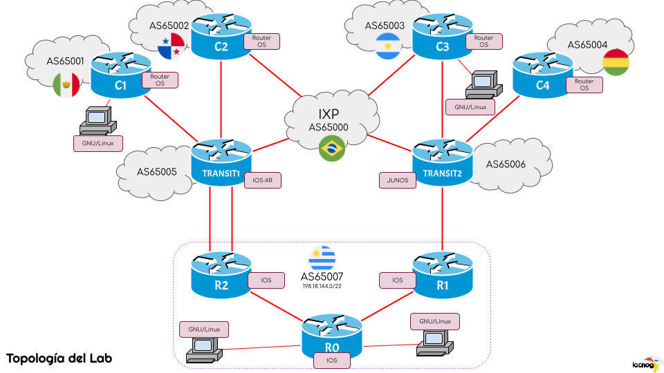
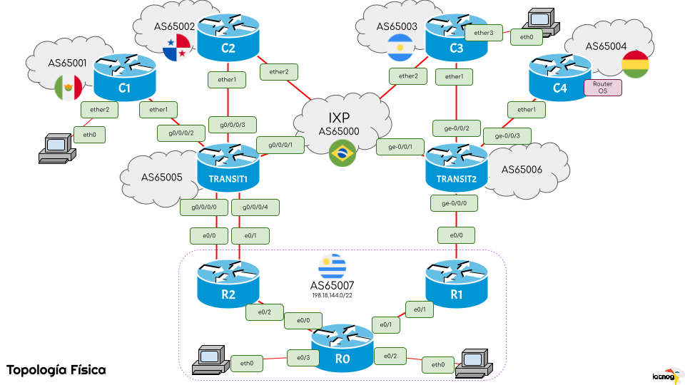
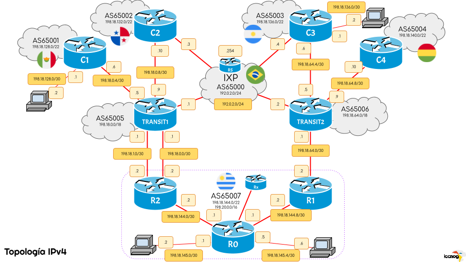
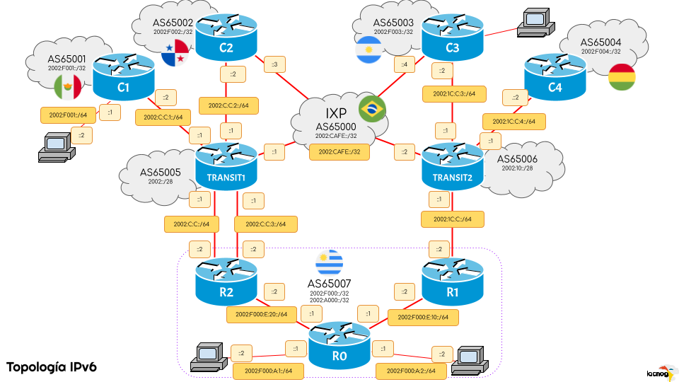
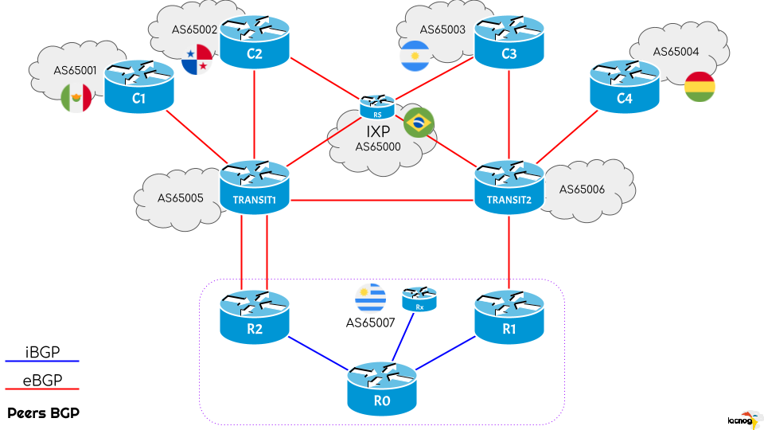

# bgp-communities-handson

## Diagramas
### Topología y sistemas operativos

### Interfaces

### IPv4

### IPv6

### Peers BGP

## Uso del lab

En el branch master están las configuraciones básicas de los equipos.
Los ejercicios y ejemplos serán almacenados en otros branches.
