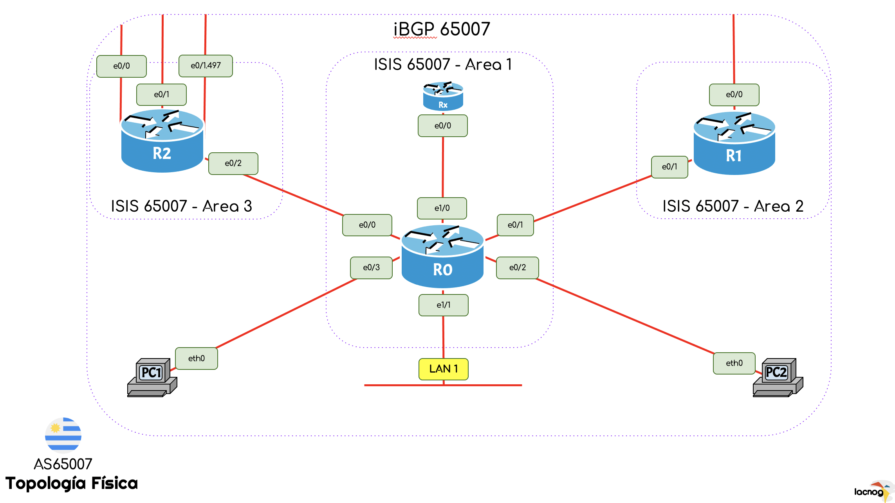

# AS65007 - Uruguay

## INTERNAL COMMUNITY LIST

----------------------------------------------------------------

### **65xxx:yyyyy**

**xxx**: set an action

**yyyyy**: indicates a specific link

----------------------------------------------------------------

### \[65**XYZ**:yyyyy]:

XYZ=000: no action

XYZ=003: add 3 prepend

XYZ=005: add 5 prepend

XYZ=100: no advertise

XYZ=111: blackhole

XYZ=200: change MED

XYZ=301: advertise to customers only

XYZ=302: advertise to regional customers only

----------------------------------------------------------------

### \[65xxx:**A**yyyy]: kind of peer

A=1: advertise to all peers

A=2: advertise to transit peers

A=3: advertise to peering peers

### \[65xxx:y**B**yyy]: peer location

B=0: no more specific link

B=1: UY

B=2: AR

B=3: BR

B=4: PA

B=5: MX

B=6: BO

### \[65xxx:yy**CC**y]: provider id

CC=00: no more specific link

CC=01: Tranist1 (AS65005)

CC=02: Transit2 (AS65006)

CC=03: IXP (AS65000)

### \[65xxx:yyyy**D**]: link id (when multiple links with same provider)

D=0: no more specific link

D=1: link No. 1

D=2: link No. 2

----------------------------------------------------------------

## Examples

- Setting **65000:10000** community will make prefix to be advertised to *all* peers (10000) with no specific action (65000).
- Setting **65000:20000** community will make prefix to be advertised to all *Transit* peers (20000) with no specific action (65000).
- Setting **65000:30000** community will make prefix to be advertised to all *Peering* peers (30000) with no specific action (65000).

----------------------------------------------------------------

.